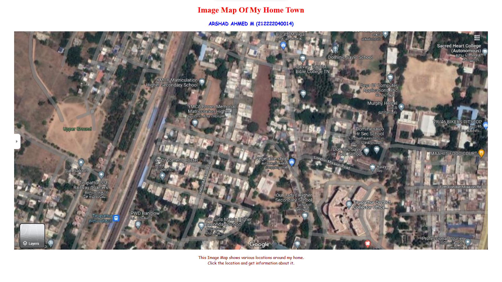
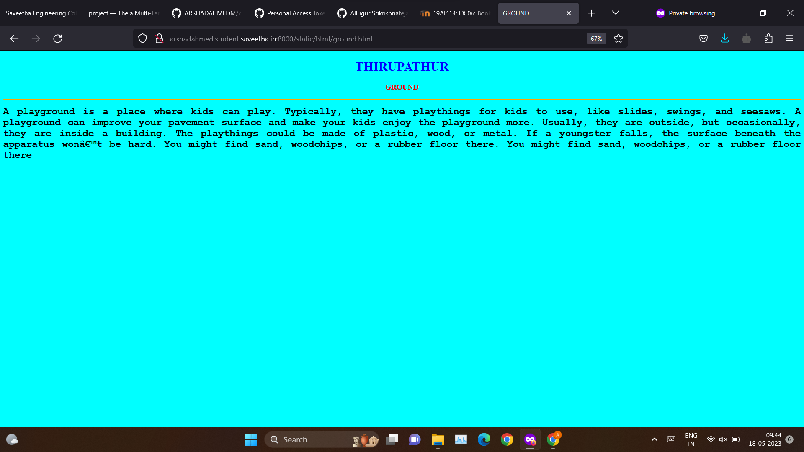
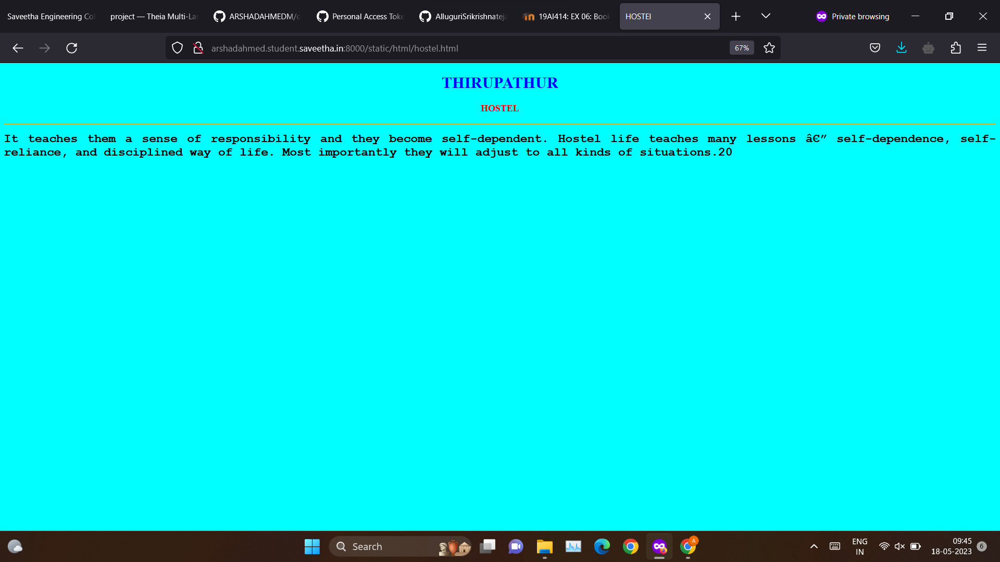
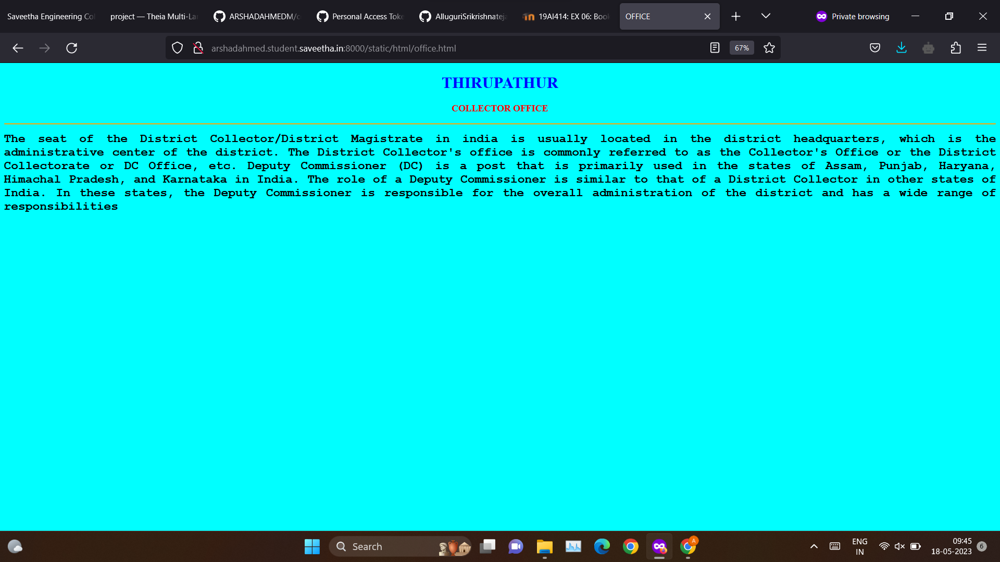

### Places Around Me
### AIM:
To develop a website to display details about the places around my house.
Design Steps:
### Step 1:
CLONE THE GIT REPOSITORY INTO THEIA IDE
### Step 2:
CREATE A NEW DJANGO PROJECT
STEP 3:
WRITE THE NEEDED HTML CODE
### STEP 4:

RUN THE DJANGO SERVER AND EXECUTE THE HTML FILES
Code:
```html
map
<!DOCTYPE html>
<html>
    <head>
        <title>
            IMAGE MAPS
        </title>
    </head>
    <body>
         <h1 align="center" >
            <font color="red" >
                    Image Map Of My Home Town
            </font>
        </h1>
         <h3 align="center">
        <font color="blue" face ="cursive">
            ARSHAD AHMED M (212222040014)
        </font>
        </h3>
        <center>
           
<map name="image-maps-2023-05-17-040541" id="ImageMapsCom-image-maps-2023-05-17-040541">
<area  alt="" title="GROUND" href="ground.html" shape="rect" coords="200,369,260,417" style="outline:none;" target="_self"     />
<area  alt="" title="SCHOOL" href="school.html" shape="rect" coords="740,261,783,314" style="outline:none;" target="_self"     />
<area  alt="" title="OFFICE" href="office.html" shape="rect" coords="1287,666,1372,721" style="outline:none;" target="_self"     />
<area  alt="" title="HOSTEL" href="hostel.html" shape="rect" coords="1407,267,1492,322" style="outline:none;" target="_self"     />
<area  alt="" title="FOOD" href="food.html" shape="rect" coords="1664,459,1749,514" style="outline:none;" target="_self"     />
<area shape="rect" coords="1900,876,1902,878" alt="Image Map" style="outline:none;" title="Image Map" href="https://www.image-maps.com/" />
</map>
        </center>
         <p align="center">
            <font color="maroon"  face="Comic Sans MS" >
                This Image Map shows various locations around my home.<br>
                Click the location and get information about it.
            </font>
        </p>
    </body>
</html>

ground
<!DOCTYPE html>
<html>
    <head>
        <title>
            GROUND
        </title>

    </head>
    <body bgcolor ="cyan">
        <h1 align="center">
            <font color = "blue">
                <b>
                    THIRUPATHUR
                </b>
            </font>
            <h1>
            <h3 align="center">
            <font color = "red">
                <b>
                   GROUND
                </b>
            </font>
            
        </h3>
<hr size="3" color="orange">
<p align="justify">
    <font face="Courier New" size="5">
        <b>
            A playground is a place where kids can play. Typically, they have playthings for kids to use, like slides, swings, and seesaws. A playground can improve your pavement surface and make your kids enjoy the playground more. Usually, they are outside, but occasionally, they are inside a building.

The playthings could be made of plastic, wood, or metal. If a youngster falls, the surface beneath the apparatus won’t be hard. You might find sand, woodchips, or a rubber floor there. You might find sand, woodchips, or a rubber floor there
        </b>
    </font>
</p>
    </body>
</html>

school
<!DOCTYPE html>
<html>
    <head>
        <title>
            SCHOOL
        </title>

    </head>
    <body bgcolor ="cyan">
        <h1 align="center">
            <font color = "blue">
                <b>
                    THIRUPATHUR
                </b>
            </font>
            <h1>
            <h3 align="center">
            <font color = "red">
                <b>
                   SCHOOL
                </b>
            </font>
            
        </h3>
<hr size="3" color="orange">
<p align="justify">
    <font face="Courier New" size="5">
        <b>
            School is the place where we learn to read and write. It is the most crucial place for a student, and it helps us to learn new things. The teachers are always helpful and teach us important things in life. We must always be regular to school as missing classes can lead to problems during exams.21
        </b>
    </font>
</p>
    </body>
</html>

office
<!DOCTYPE html>
<html>
    <head>
        <title>
            OFFICE
        </title>

    </head>
    <body bgcolor ="cyan">
        <h1 align="center">
            <font color = "blue">
                <b>
                    THIRUPATHUR
                </b>
            </font>
            <h1>
            <h3 align="center">
            <font color = "red">
                <b>
                   COLLECTOR 
                   OFFICE
                </b>
            </font>
            
        </h3>
<hr size="3" color="orange">
<p align="justify">
    <font face="Courier New" size="5">
        <b>
            The seat of the District Collector/District Magistrate in india is usually located in the district headquarters, which is the administrative center of the district. The District Collector's office is commonly referred to as the Collector's Office or the District Collectorate or DC Office, etc.

Deputy Commissioner (DC) is a post that is primarily used in the states of Assam, Punjab, Haryana, Himachal Pradesh, and Karnataka in India. The role of a Deputy Commissioner is similar to that of a District Collector in other states of India.

In these states, the Deputy Commissioner is responsible for the overall administration of the district and has a wide range of responsibilities
        </b>
    </font>
</p>
    </body>
</html>

school
<!DOCTYPE html>
<html>
    <head>
        <title>
            HOSTEl
        </title>

    </head>
    <body bgcolor ="cyan">
        <h1 align="center">
            <font color = "blue">
                <b>
                    THIRUPATHUR
                </b>
            </font>
            <h1>
            <h3 align="center">
            <font color = "red">
                <b>
                   HOSTEL
                </b>
            </font>
            
        </h3>
<hr size="3" color="orange">
<p align="justify">
    <font face="Courier New" size="5">
        <b>
           It teaches them a sense of responsibility and they become self-dependent. Hostel life teaches many lessons — self-dependence, self-reliance, and disciplined way of life. Most importantly they will adjust to all kinds of situations.20
        </b>
    </font>
</p>
    </body>
</html>

food
<!DOCTYPE html>
<html>
    <head>
        <title>
            FOOD
        </title>

    </head>
    <body bgcolor ="cyan">
        <h1 align="center">
            <font color = "blue">
                <b>
                    THIRUPATHUR
                </b>
            </font>
            <h1>
            <h3 align="center">
            <font color = "red">
                <b>
                   FOOD
                </b>
            </font>
            
        </h3>
<hr size="3" color="orange">
<p align="justify">
    <font face="Courier New" size="5">
        <b>
            Food is the substance we eat every day for energy and strength. There are many different types of food, such as fruits, vegetables, rice, and pasta. We need to eat a variety of foods to get all the essential nutrients the body needs. Not eating a healthy and balanced diet leads to weakness and deficiency diseases.
        </b>
    </font>
</p>
    </body>
</html>
```
## Output:









## Result:
The program for implementing image map is executed successfully